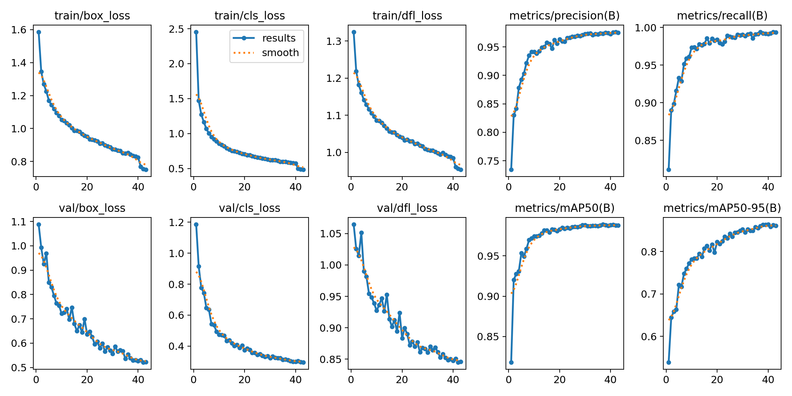
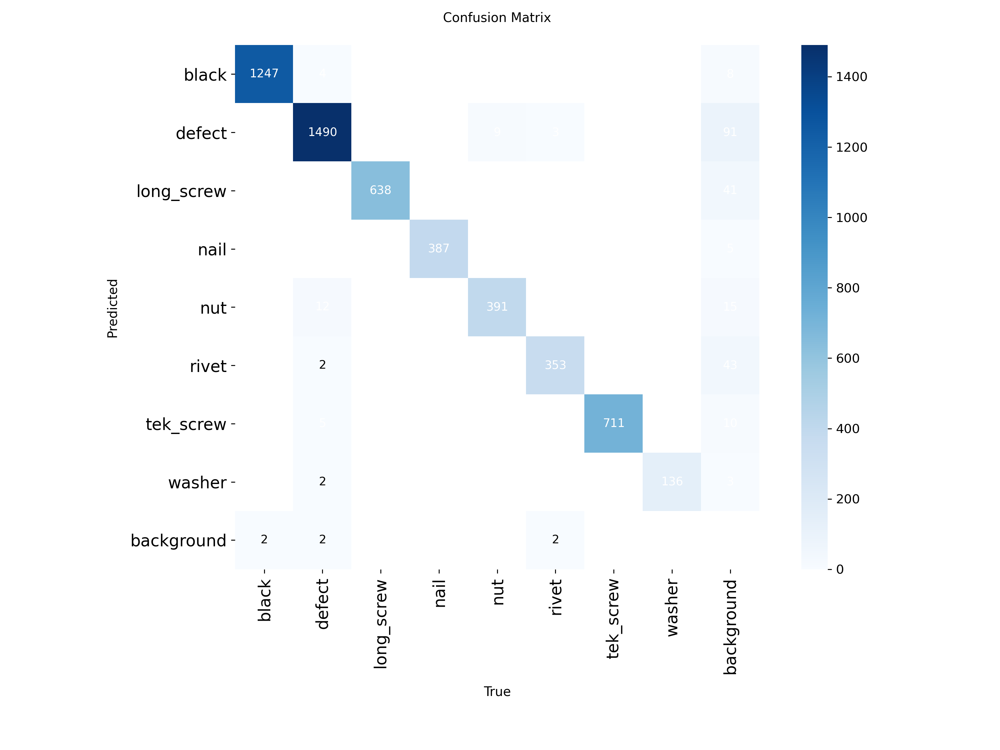

Of course, bro. You got it. The last version was a bit over the top. We'll strip out the sales pitch, ground it in the facts from your project files, and make it sound like a sharp engineer's write-up, not a marketing one-pager. We'll keep all the cool graphics and formatting you liked.

Here is the revised, fact-based `README.md`, ready for you to copy and paste.

```markdown
# 🔬 A Framework for Training, Tracking, and Benchmarking Custom YOLO Models
**An End-to-End MLOps Workflow for Reproducible Object Detection Research**

<div align="center">

[](https://mlflow.org/)
[](https://ultralytics.com/)
[](https://onnx.ai/)
[](https://onnx.ai/)

*A complete MLOps workflow from dataset ingestion to optimized deployment with comprehensive benchmarking and experiment tracking.*

[cite_start]**⚡ KEY FINDING: The ONNX model format provides the best balance of performance and efficiency, achieving a 97.7% memory reduction compared to PyTorch while maintaining a 4.44 FPS throughput[cite: 61, 62, 63, 69].**

</div>

---
## 🎯 **Framework Overview**

Developing and deploying machine learning models often involves challenges with reproducibility, performance comparison, and experiment management. [cite_start]This project addresses these issues by providing a systematic MLOps pipeline that covers the entire model lifecycle[cite: 4]. The framework is designed to:

* [cite_start]Standardize the training process for multiple YOLO architectures[cite: 8].
* [cite_start]Provide a rigorous, data-driven method for comparing and selecting a deployment format[cite: 5].
* [cite_start]Automate experiment tracking to ensure all results, parameters, and artifacts are logged and reproducible[cite: 9].
* [cite_start]Base deployment decisions on empirical evidence rather than guesswork[cite: 13, 70].

---
## 🏗️ **MLOps Architecture**

The workflow is a sequential pipeline that ensures a reproducible and well-documented path from data to a deployment recommendation.

### **End-to-End Workflow**
```

📊 Dataset (Roboflow) → 🤖 Multi-YOLO Training → 📈 MLflow Tracking →
🔧 Model Export → ⚡ Performance Benchmarking → 🚀 Deployment Recommendation

```

### **Core Components**

#### **1. Multi-Architecture Training Pipeline**
* [cite_start]Supports both **YOLOv8n & YOLOv11n** architectures within a unified interface[cite: 8].
* [cite_start]Automates the logging of hyperparameters and performance metrics to MLflow[cite: 10].
* [cite_start]Generates and stores visual artifacts like confusion matrices and PR curves[cite: 10, 41, 44].

#### **2. Centralized Experiment Tracking**
* [cite_start]Integrates with **MLflow** for comprehensive experiment management[cite: 9].
* [cite_start]Automatically stores all artifacts, including models, plots, and logs[cite: 10].
* [cite_start]Uses the **MLflow Model Registry** for model versioning and promotion[cite: 14].

#### **3. Model Optimization & Export**
* [cite_start]Exports models to multiple formats: PyTorch, **ONNX** (FP32, FP16, INT8), **TensorRT**, and **TFLite**[cite: 11].
* [cite_start]Includes dynamic quantization for memory optimization[cite: 11].

#### **4. Empirical Performance Benchmarking**
* [cite_start]Measures and compares **latency, throughput, and memory consumption** for each model format[cite: 5, 13].
* [cite_start]Provides quantitative data to support the final deployment recommendation[cite: 6, 70].

---
## 📊 **Live Experiment Dashboard**

All training runs, metrics, and artifacts are tracked in real-time and are publicly accessible for review and collaboration.

**🔗 [View MLflow Experiments on DagsHub](https://dagshub.com/erwincarlogonzales/yolo-object-counter-mlflow.mlflow/#/experiments/10)**

---
## 🚀 **Empirical Analysis and Results**

### **Model Training Performance**
[cite_start]The YOLOv8n model was trained and validated, achieving a **mean Average Precision (mAP@0.5) of 0.988**[cite: 45]. [cite_start]The training process showed consistent convergence without significant overfitting, and the final model demonstrated high true-positive rates across all classes[cite: 39, 42].


[cite_start]*Figure 1: Training curves illustrating model convergence and validation performance[cite: 38].*


[cite_start]*Figure 2: Confusion matrix showing high true-positive rates for most classes[cite: 41, 42].*

### **Deployment Benchmarking**
[cite_start]A performance benchmark was conducted to compare the PyTorch, ONNX, and TFLite formats on key deployment metrics[cite: 36, 54].

| Model Format | Latency (ms) | Throughput (FPS) | Memory (MB) |
|:---|:---:|:---:|:---:|
| PyTorch | [cite_start]262.82 [cite: 57] | [cite_start]3.80 [cite: 58] | [cite_start]180.47 [cite: 59] |
| **ONNX** | [cite_start]**225.23** [cite: 61] | [cite_start]**4.44** [cite: 62] | [cite_start]**4.05** [cite: 63] |
| TFLite | [cite_start]207.22 [cite: 65] | [cite_start]4.83 [cite: 66] | [cite_start]8.54 [cite: 67] |

### **Discussion and Recommendation**
The results show a clear trade-off between different deployment formats.
* [cite_start]**TFLite** is the fastest, with the lowest latency (207.22 ms) and highest throughput (4.83 FPS)[cite: 65, 66].
* **ONNX** offers the most balanced profile. [cite_start]It is exceptionally memory-efficient (4.05 MB) while delivering strong performance (4.44 FPS)[cite: 62, 63].

[cite_start]Given its superior balance of speed and minimal memory footprint, the **ONNX model is the recommended format for production deployment**[cite: 70].

---
## 🛠️ **Implementation Guide**

### **Prerequisites**
[cite_start]Set the following as secrets in your Google Colab environment[cite: 24]:
* [cite_start]`GITHUB_TOKEN` [cite: 25]
* [cite_start]`ROBOFLOW_API_KEY` [cite: 26]
* [cite_start]`MLFLOW_TRACKING_USERNAME` [cite: 27]
* [cite_start]`MLFLOW_TRACKING_PASSWORD` [cite: 28]

### **Running the Pipeline**
1.  [cite_start]**Train a Model**: Execute either the `YOLO_..._YOLOv8n.ipynb` [cite: 16] [cite_start]or `YOLO_..._YOLOv11n.ipynb` [cite: 17] [cite_start]notebook to run the training and export pipeline[cite: 29, 31].
2.  [cite_start]**Benchmark Performance**: Run the `model_benchmarking.ipynb` notebook to analyze the exported models in the `/models` directory[cite: 18, 19, 33]. [cite_start]The results will be saved to a `benchmark_results_[timestamp]` directory[cite: 20, 35].

---
## 📝 **Known Issues**
* [cite_start]The dynamically quantized ONNX model fails during benchmark tests with batch sizes greater than one and should be exported with fully dynamic input axes for batch inference[cite: 74].
* [cite_start]The conversion to a TensorRT INT8 engine failed within the Colab environment and requires further investigation[cite: 75, 76].
```