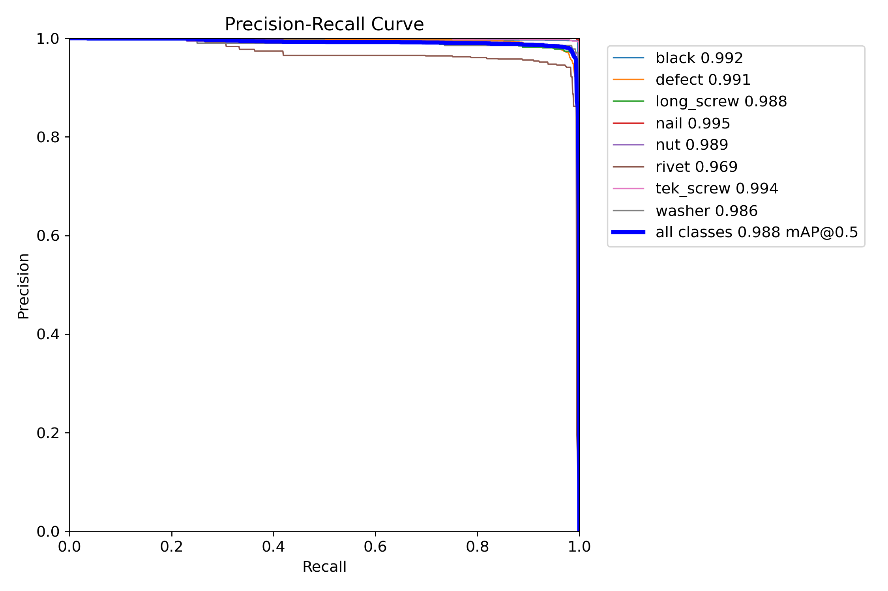
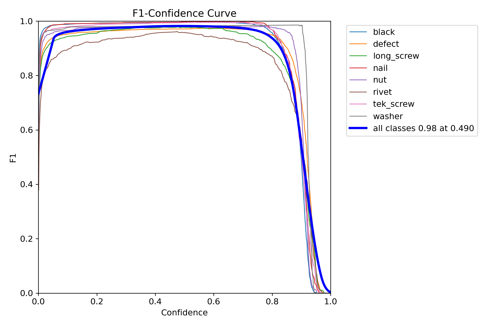
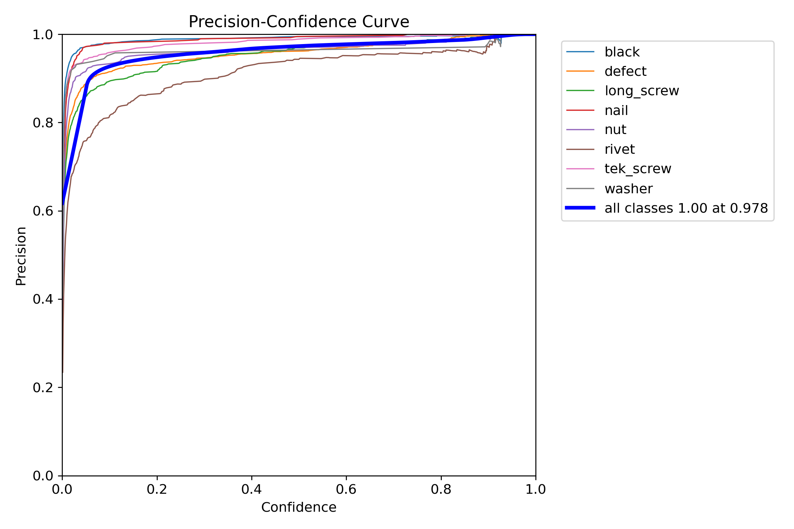
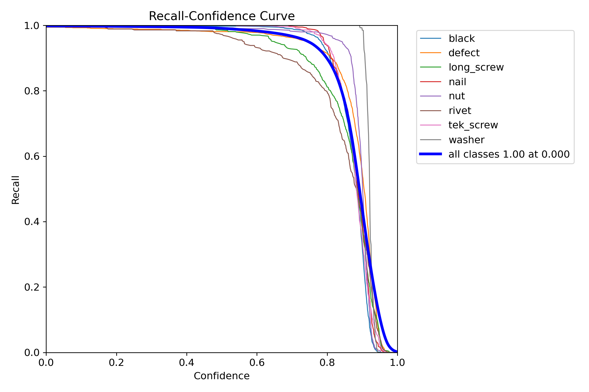
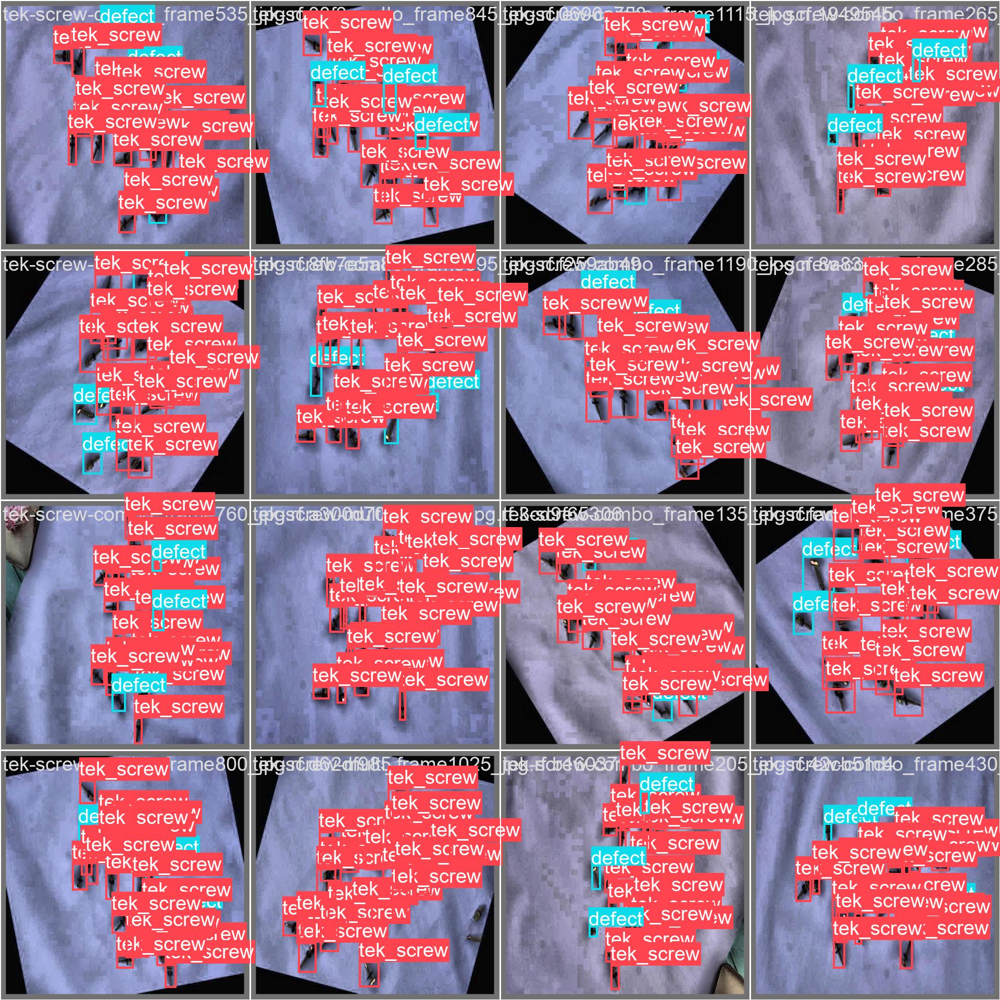
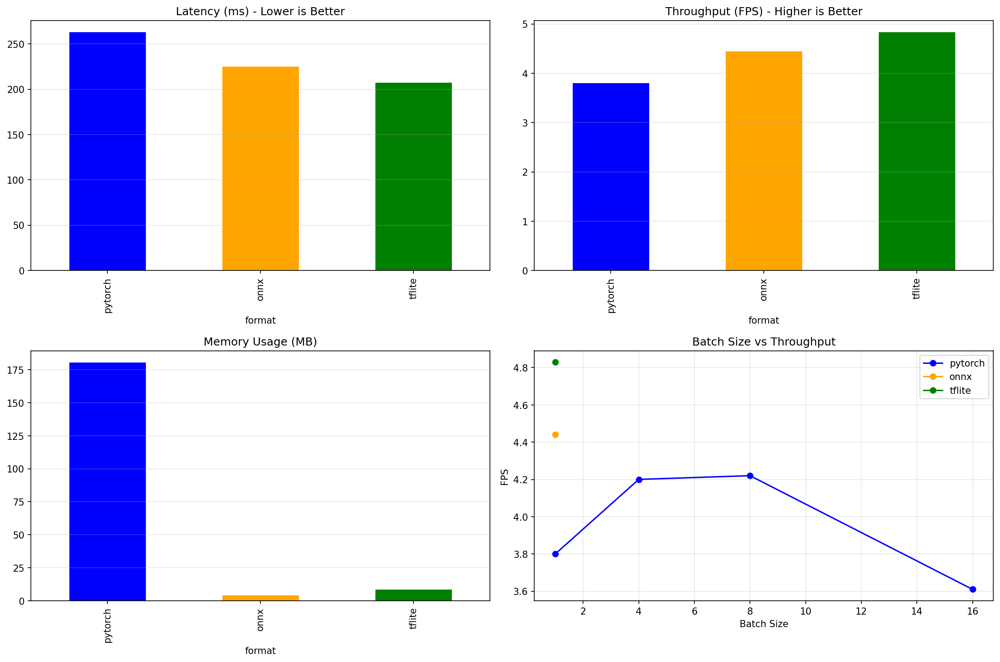

# ⚡ A Framework for Training, Tracking, and Benchmarking Custom YOLO Object Detection Models
**An End-to-End MLOps Workflow for Reproducible Research and Optimized Deployment**

<div align="center">

[](https://mlflow.org/)
[](https://ultralytics.com/)
[](https://python.org)
[](https://onnx.ai/)

*A comprehensive framework for the entire machine learning lifecycle, from dataset integration and experiment tracking to performance benchmarking and deployment optimization.*

**⚡ KEY FINDING: The ONNX model format is formally recommended for production, providing the optimal balance of computational performance and memory efficiency with a 97.7% memory reduction over the native PyTorch format.**

</div>

---

## 📋 **Project Abstract**

This document outlines a comprehensive framework for the development and evaluation of custom object detection models utilizing the YOLO (You Only Look Once) architecture. The project presents an integrated workflow implemented within a Google Colab environment, designed to facilitate reproducible research and streamlined deployment. The methodology encompasses the entire machine learning lifecycle, including dataset integration from Roboflow, model training for YOLOv8n and YOLOv11n variants, comprehensive experiment tracking using MLflow, and subsequent model optimization via export to high-performance inference formats such as ONNX and TensorRT. A key component of this framework is a dedicated benchmarking module for the empirical analysis of latency, throughput, and memory consumption of the exported model artifacts. The results of this analysis establish the ONNX format as the optimal candidate for deployment.

---

## 🏗️ **Methodological Framework**

The project is structured as an end-to-end MLOps workflow, integrating several key components to ensure a systematic and reproducible approach to model development.

- **Multi-Architecture Support**: The framework is designed to train and evaluate multiple YOLO variants, specifically the YOLOv8n and YOLOv11n architectures.
- **Integrated Experiment Tracking**: All training sessions are logged using MLflow. This includes the automatic logging of hyperparameters, performance metrics (e.g., mean Average Precision (mAP), Precision, Recall), and visual artifacts such as confusion matrices and validation predictions.
- **Advanced Model Export**: The system provides functionality to convert trained PyTorch models into several optimized formats suitable for inference, including ONNX (with FP32, FP16, and INT8 dynamic quantization) and NVIDIA TensorRT engines.
- **Empirical Performance Benchmarking**: A dedicated Jupyter Notebook (`model_benchmarking.ipynb`) is included for a quantitative comparison of the exported models. This module evaluates latency, throughput, and memory usage to inform deployment decisions.
- **Model Lifecycle Management**: The workflow incorporates the use of the MLflow Model Registry to version, manage, and promote models from experimentation to production stages.

---

## 📈 **Project Resources & Tracking**

All experimental runs, including parameters, metrics, and artifacts, are centrally managed and can be reviewed at the following MLflow tracking URI. This ensures full transparency and reproducibility of the research findings.

- [**View MLflow Experiments on DagsHub**](https://dagshub.com/erwincarlogonzales/yolo-object-counter-mlflow.mlflow/#/experiments/10)

---

## 📁 **Repository Structure**

The repository is organized to separate concerns between training, benchmarking, and the storage of model artifacts.

```
├── README.md
├── YOLO_Detection_Counting_MLflow_Experiments_YOLOv8n.ipynb
├── YOLO_Detection_Counting_MLflow_Experiments_YOLOv11n.ipynb
├── model_benchmarking.ipynb
├── training_results/
│   ├── results.png
│   ├── confusion_matrix.png
│   ├── PR_curve.png
│   ├── F1_curve.png
│   ├── P_curve.png
│   ├── R_curve.png
│   └── val_batch0_labels.jpg
├── models/
│   ├── yolov8n_best_int8_dynamic.onnx
│   ├── yolov8n_float16.tflite
│   └── yolov8n_pytorch_float16.pt
└── benchmark_results_[timestamp]/
    ├── results.csv
    └── results.json
```

**Key Components:**
- **`YOLO_..._YOLOv8n.ipynb`**: A Jupyter notebook containing the complete implementation of the training, export, and logging pipeline for the YOLOv8n architecture.
- **`YOLO_..._YOLOv11n.ipynb`**: A Jupyter notebook providing the identical pipeline, adapted for the YOLOv11n architecture.
- **`model_benchmarking.ipynb`**: A standalone notebook for conducting performance analysis of the various exported model formats.
- **`/models`**: A directory containing the exported model files (`.pt`, `.onnx`, `.tflite`) that serve as inputs for the benchmarking notebook.
- **`/benchmark_results_...`**: An output directory containing the results of the performance benchmarks in both `.csv` and `.json` formats.

---

## 🚀 **Implementation Guide**

To replicate the experiments and utilize the framework, perform the following steps in a Google Colab environment.

### **1. Prerequisite: Configure Environment Credentials**
The framework requires access to external services. These must be configured as secrets within the Google Colab environment.

- `GITHUB_TOKEN`: A GitHub personal access token with repository access rights.
- `ROBOFLOW_API_KEY`: An API key from a Roboflow account for programmatic dataset downloads.
- `MLFLOW_TRACKING_USERNAME`: The associated username for the MLflow tracking server (e.g., DagsHub).
- `MLFLOW_TRACKING_PASSWORD`: The corresponding access token or password for the MLflow tracking server.

### **2. Execute the Training and Export Pipeline**
1. Select either the `YOLO_..._YOLOv8n.ipynb` or `YOLO_..._YOLOv11n.ipynb` notebook.
2. Execute the notebook cells sequentially to run the full pipeline: dataset download, model training, logging to MLflow, and exporting the final model to all specified formats.

### **3. Execute the Performance Benchmarks**
1. Ensure the exported models are present in the `/models` directory.
2. Open the `model_benchmarking.ipynb` notebook.
3. Execute the cells sequentially to run the benchmarks. Results will be generated and saved to a new `benchmark_results_[timestamp]` directory.

---

## 📊 **Empirical Analysis and Results**

A rigorous performance analysis was conducted on the exported YOLOv8n models to determine the optimal format for deployment.

### **Model Training Performance**
The model demonstrated successful convergence during training, achieving a **mean Average Precision (mAP@0.5) of 0.988**. Visual artifacts such as the learning curves and confusion matrix confirm that the model learned effectively without significant overfitting and achieved high true-positive rates across all object classes.

### **Model Performance Visualization**

**Figure 1: Training and Validation Learning Curves**  
The learning curves illustrate the model's convergence over the training epochs. The plots for training and validation losses (box, class, and DFL loss) demonstrate a consistent downward trend, indicating successful learning without significant overfitting. Concurrently, key performance metrics such as precision, recall, and mean Average Precision (mAP) show a stable increase toward their respective asymptotes.


**Figure 2: Confusion Matrix for Class-level Performance**  
The confusion matrix provides a granular assessment of the model's classification accuracy. The strong diagonal concentration signifies high true-positive rates for most classes. Off-diagonal values highlight specific areas of inter-class confusion, such as the minor confusion between `long_screw` and `defect` classes.


**Figure 3: Precision-Recall (PR) Curve**  
The PR curve illustrates the trade-off between precision and recall. The area under this curve is a critical metric, and for all classes, the model achieves a mean Average Precision at an IoU threshold of 0.5 (mAP@0.5) of 0.988. This high value indicates that the model maintains high precision even as recall increases, which is characteristic of a robust detector.



**Figure 4: F1-Score vs. Confidence Threshold**  
This curve plots the F1-score as a function of the confidence threshold. The model achieves its maximum F1-score of 0.98 at a confidence threshold of approximately 0.490. This optimal threshold represents the point of equilibrium between precision and recall and is a critical parameter for tuning the detector for deployment.



**Figures 5 & 6: Precision and Recall vs. Confidence**  
These curves further dissect the model's behavior. The Precision-Confidence curve shows that precision remains high across nearly all thresholds. The Recall-Confidence curve illustrates that recall is maintained at near-perfect levels for confidence scores up to approximately 0.8 before declining.

  
*Figure 5: Precision vs. Confidence Threshold.*

  
*Figure 6: Recall vs. Confidence Threshold.*

  
*Figure 7: Validation Batch Predictions*

### **Deployment Benchmarking Results**
The following table summarizes the performance of each model format for single-instance inference, highlighting the trade-offs between speed and memory consumption.



| Model Format | Mean Latency (ms) | Throughput (FPS) | Memory Footprint (MB) |
| :------------- | :------------------ | :----------------- | :---------------------- |
| PyTorch        | 262.82              | 3.80               | 180.47                  |
| **ONNX** | **225.23** | **4.44** | **4.05** |
| TFLite         | 207.22              | 4.83               | 8.54                    |

### **Discussion and Recommendation**

The empirical data reveals a significant performance differential between the native PyTorch training format and the optimized inference formats. While the TFLite model achieved the lowest latency, the **ONNX model demonstrated exceptional memory efficiency, with a 97.7% reduction compared to PyTorch.**

Based on this quantitative analysis, the **ONNX model is formally recommended for production deployment**. It provides a superior synthesis of high-speed performance and minimal memory resource consumption, making it an ideal candidate for a wide range of applications, from resource-constrained edge devices to scalable, cost-effective cloud infrastructure.

---

## 🔮 **Future Work and Known Issues**

For the sake of academic transparency and to guide future research, the following limitations are noted:

- **ONNX Dynamic Batching Incompatibility**: The dynamically quantized ONNX model currently fails during benchmark tests with batch sizes greater than one. Future work should involve exporting the ONNX model with fully dynamic input axes to enable variable batch size inference.
- **TensorRT INT8 Export Failures**: The conversion to a TensorRT INT8 engine consistently resulted in a session failure within the Colab environment, necessitating further investigation into the INT8 calibration process and potential platform incompatibilities.
- **Integration of TensorRT Benchmarking**: The benchmarking notebook should be extended to include performance tests for the exported TensorRT `.engine` files, providing a more complete comparison, especially for NVIDIA hardware environments.

---

## 🎓 **Professional Impact**

This project demonstrates mastery across multiple domains critical to modern AI engineering and research:

**🔬 Research Excellence:**
- Implementation of a systematic and reproducible MLOps workflow
- Rigorous empirical analysis of model performance across multiple deployment formats
- Clear communication of a data-backed recommendation for production systems

**💻 Technical Expertise:**
- Integration of multiple state-of-the-art architectures (YOLOv8n, YOLOv11n)
- Advanced experiment tracking and model lifecycle management with MLflow
- Model optimization and quantization for high-performance formats like ONNX and TensorRT

**🧠 Strategic Insight:**
- Development of a comprehensive framework for model development and evaluation
- Quantitative analysis to inform critical, real-world deployment decisions
- Emphasis on reproducibility, transparency, and academic rigor

---

## 📜 **License**

This project is distributed under the terms of the MIT License. Please refer to the `LICENSE` file for full details.

---

<div align="center">

**🔬 Methodologically Rigorous • 📊 Empirically Validated • 🚀 Production-Oriented**

*Bridging academic research with practical deployment considerations*

</div>